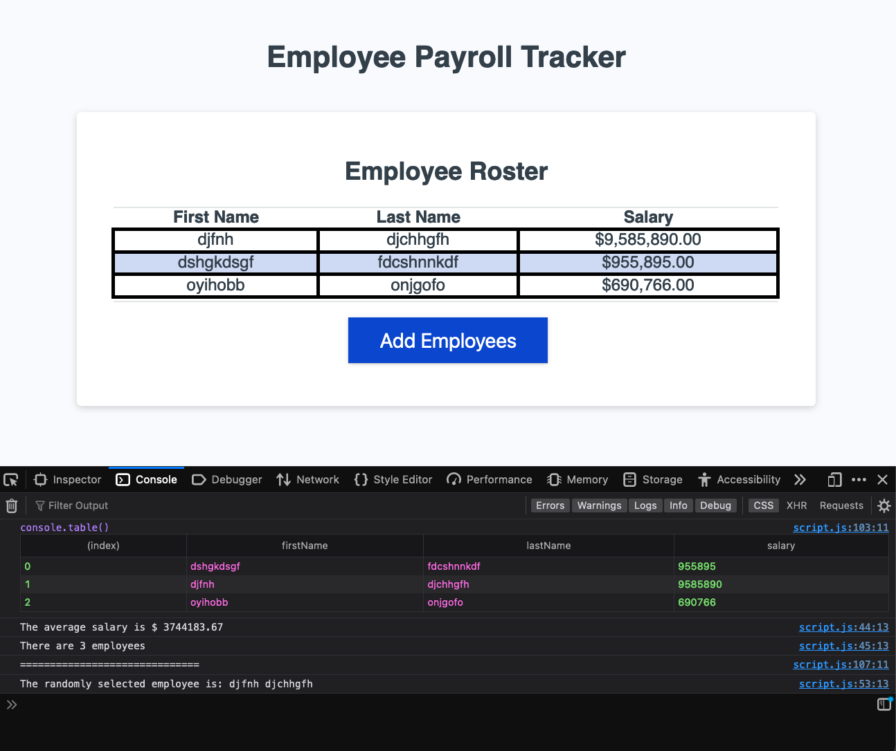

# JavaScript_2.0

#JavaScript Payroll Solution

##Website created as a portal for inputting basic employee data. To be completed with the proper functions passing the correct arguments.

Below is a short description explaining the what, why, and how of my project. I have use thed following questions as a guide:

### - What was your motivation?
I was motivated to build this page using JavaScript code to practice building and debugging a website.
### - Why did you build this project? (Note: the answer is not "Because it was a homework assignment.")
This has been the hardest homework, so far.  It was extremely challenging, but it will be useful as a reference tool for future builds.
### - What problem does it solve?
It provides a list of data that is searchable and archiveable.
### - What did you learn?
JavaScript Arrays

## Table of Contents (Optional)

- [Installation](#installation)
- [Usage](#usage)
- [Credits](#credits)
- [License](#license)

## Installation

Code written in JavaScript to present as a website to use as an example of input data collection in an array that returns an alphabetized list of employees and their average salary.

## Usage

https://p5yc0dr3am3r.github.io/JavaScript_2.0/

## Credits

Discord group and in class instruction.
Consulted ChatGPT, W3schools.com, StackOverflow.com, MDN Web Docs

## License

Copyright (c) 2012-2024 Scott Chacon and others

Permission is hereby granted, free of charge, to any person obtaining
a copy of this software and associated documentation files (the
"Software"), to deal in the Software without restriction, including
without limitation the rights to use, copy, modify, merge, publish,
distribute, sublicense, and/or sell copies of the Software, and to
permit persons to whom the Software is furnished to do so, subject to
the following conditions:

The above copyright notice and this permission notice shall be
included in all copies or substantial portions of the Software.

THE SOFTWARE IS PROVIDED "AS IS", WITHOUT WARRANTY OF ANY KIND,
EXPRESS OR IMPLIED, INCLUDING BUT NOT LIMITED TO THE WARRANTIES OF
MERCHANTABILITY, FITNESS FOR A PARTICULAR PURPOSE AND
NONINFRINGEMENT. IN NO EVENT SHALL THE AUTHORS OR COPYRIGHT HOLDERS BE
LIABLE FOR ANY CLAIM, DAMAGES OR OTHER LIABILITY, WHETHER IN AN ACTION
OF CONTRACT, TORT OR OTHERWISE, ARISING FROM, OUT OF OR IN CONNECTION
WITH THE SOFTWARE OR THE USE OR OTHER DEALINGS IN THE SOFTWARE.

<pre>
 ____   ___  _  _  ___  __  ____  ____  ____   __   _  _  ____  ____ 
(  _ \ / __)( \/ )/ __)/  \(    \(  _ \( __ \ / _\ ( \/ )( __ \(  _ \
 ) __/(___ \ )  /( (__(  0 )) D ( )   / (__ (/    \/ \/ \ (__ ( )   /
(__)  (____/(__/  \___)\__/(____/(__\_)(____/\_/\_/\_)(_/(____/(__\_)
</pre>